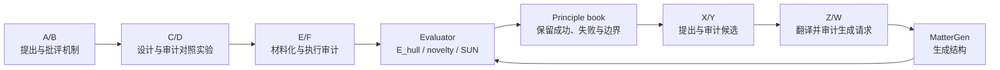

# Crystal-LLM Agents

面向晶体结构发现的多智能体闭环系统：A–F 负责提出、反驳并用对照实验验证材料学原理，X/Y/Z/W 负责把已验证经验转化为候选设计，MatterGen 负责生成晶体结构，统一 evaluator 返回稳定性、新颖性与 S.U.N. 反馈。

This repository is a compact public-release candidate for a multi-agent crystal-structure discovery workflow coupled to MatterGen and an evaluator feedback loop.

> 当前文件夹是从完整实验工作区抽取的公开发布包。发布前仍需补充作者、许可证与引用信息；详见 [发布前检查清单](docs/PRE_RELEASE_CHECKLIST.md)。

## 主要结果

以下均为当前 evaluator 的 **in-sample** 结果，不代表 out-of-sample、DFT 或实验验证：

| 指标 | 结果 |
|---|---:|
| 最终结构数 | 1000 |
| 严格 S.U.N.（`E_hull < 0`） | 344 / 1000（34.4%） |
| `E_hull < 0.03 eV/atom` | 592 / 1000（59.2%） |
| `E_hull < 0.10 eV/atom` | 884 / 1000（88.4%） |
| 成分唯一 / 结构唯一 | 1000 / 1000；1000 / 1000 |
| 成分新颖 / 结构新颖 | 100%；100% |
| evaluator `structural_validity` | 37 / 1000（3.7%） |
| 最低 `E_hull` | -0.262347 eV/atom |

`structural_validity=3.7%` 是必须同时报告的限制：该 evaluator 的结构有效性规则包含 `volume/atom < 30 ų`，与 `success_rate.validity_rate=100%` 所表示的“oracle 成功返回结果”不是同一个概念。完整解释见 [结果与边界](docs/RESULTS.md)。

## 方法概览



项目把“材料学判断”“可证伪实验设计”“生成器契约”和“数值评估”分开，避免 LLM 直接手写坐标或仅凭单个低能候选过度泛化规律。详细角色和数据流见 [系统架构](docs/ARCHITECTURE.md)。

## 快速检查

推荐 Python 3.10–3.12；本发布包在 Python 3.12.2 下校验。

```bash
python -m venv .venv
source .venv/bin/activate
pip install -r requirements.txt
python scripts/verify_release.py
PYTHONPATH=src pytest -q
```

生成一份新的、确定性的模板基线（默认写入 `generated/input.json`，不会覆盖冻结结果）：

```bash
./generate.sh
```

该命令验证本地模板生成路径，不会重放形成最终 1000 个 MatterGen 结构的完整 LLM 轨迹。冻结的已评估结果保存在根目录 [input.json](input.json) 和 [results.json](results.json)。完整复现层级见 [复现说明](docs/REPRODUCIBILITY.md)。

## 关键文件

| 路径 | 内容 |
|---|---|
| `src/crystal_llm/run_material_physics_mvp.py` | A/B/C/D/E/F 原理发现控制器 |
| `src/crystal_llm/run_xy_experience_debate.py` | X/Y/Z/W 经验利用与候选生成控制器 |
| `mattergen_backend_prototype/mattergen_adapter.py` | MatterGen 请求、结构转换、过滤与去重适配器 |
| `src/crystal_llm/generate.py` | 程序化模板生成器与冻结策略执行入口 |
| `src/crystal_llm/llm_client.py` | OpenAI-compatible Responses API 客户端与容错逻辑 |
| `input.json` | evaluator 实际读取的 1000 条紧凑 Pymatgen MSON 结构 |
| `results.json` | 对上述 1000 条结构的聚合评估结果 |
| `artifacts/intermediate_data.md` | 15 条验证原理、45 组关键对照实验和 1000 条材料能量 |
| `artifacts/final_materials.csv` | 1000 条化学式、`E_hull` 与 in-sample S.U.N. 标签 |
| `artifacts/af_principles_state.json` | 可供 X/Y 读取的精简 A–F 原理状态 |
| `SOURCE_MANIFEST.json` | 发布文件来源与源文件校验和 |

完整目录说明见 [代码与数据清单](docs/CODE_AND_DATA.md)。

## 发布边界

本包没有包含：真实 `.env`、API 凭据、历史 controller/Slurm 日志、数百轮运行目录、约 2 GB patched phase-diagram 数据、MatterGen checkpoint、旧结果快照和课程 PDF。外部 evaluator 数据与 MatterGen 环境需要合法地单独获取。

## 许可证与引用

当前尚未代替项目所有者选择许可证，也没有作者信息，因此该目录暂不含正式 `LICENSE` 或 `CITATION.cff`。公开推送前请完成 [发布前检查清单](docs/PRE_RELEASE_CHECKLIST.md)，并将 `CITATION.cff.template` 填写后重命名为 `CITATION.cff`。
